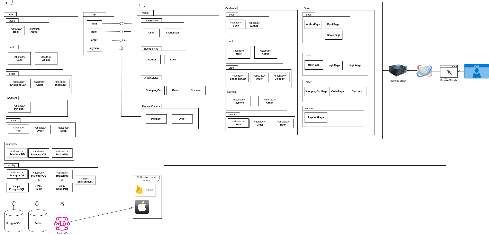
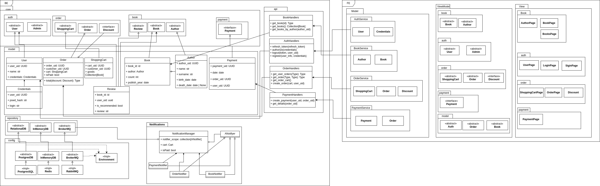

# **Архитектурная документация сервиса "Магазин книг"**

---

### Общие сведения о системе
Сервис "Магазин книг" предназначен для продажи книг через интернет. Система поддерживает веб-интерфейс и подключение через API для других систем.

Основная функциональность:
- Поиск и детальное описание книг.
- Оплата заказов онлайн.
- Корзина
- Отзывы

---

### Architectural Drivers

#### Функциональные требования
- Поиск книг по заголовкам, авторам.
- Многоканальный доступ (веб, партнерские сайты, API).
- Обработка отзывов.

---

### Роли и случаи использования
#### Роли:
1. Клиенты:
   - Искать и покупать книги.
   - Оставлять отзывы.
2. Администраторы:
   - Модерировать отзывы.
   - Добавлять редакторские отзывы.

---

### Композиция
#### Диаграмма компонент

##### Backend (BE)
Backend реализован в модульной архитектуре с использованием подхода Clean Architecture, включающей следующие слои:

##### 1. **Core**
- **Book**: Модуль управления книгами и авторами.
- **Auth**: Модуль аутентификации и управления пользователями.
- **Order**: Управление корзинами, заказами и скидками.
- **Payment**: Обработка платежей.

###### 2. **Repository**
- **RelationalDB**: Используется PostgreSQL для хранения основных данных.
- **InMemoryDB**: Используется Redis для кэширования и ускорения запросов.
- **BrokerMQ**: RabbitMQ для асинхронного взаимодействия между сервисами.

###### 3. **Config**
- **PostgresDB**: Конфигурация и подключение к PostgreSQL.
- **Redis**: Настройки и кэширование.
- **RabbitMQ**: Настройки брокера сообщений.
- **Environment**: Управление переменными окружения.

##### Frontend (FE)
Frontend представлен следующими компонентами:

###### 1. **Model**
- Определяет сущности, используемые в интерфейсе: User, Credentials, Author, Book, ShoppingCart, Order, Payment.

###### 2. **ViewModel**
- Логика связывает модель данных с представлением для следующих сущностей:
  - **Book**: Книги и авторы.
  - **Auth**: Пользователи и администраторы.
  - **Order**: Корзина, заказы, скидки.
  - **Payment**: Обработка платежей.

###### 3. **View**
- Визуальные компоненты:
  - Страницы книг (AuthorPage, BookPage, BooksPage).
  - Страницы авторизации (UserPage, LoginPage, SignInPage).
  - Страницы заказов (ShoppingCartPage, OrderPage).
  - Страница оплаты (PaymentPage).

#### Интеграция и инфраструктура
- **Обратный прокси**: Используется для маршрутизации запросов между FE и BE.
- **Сервисы уведомлений**: Firebase и Apple Push Notifications для уведомлений пользователей.
- **Базы данных**: PostgreSQL для хранения данных и Redis для кэша.
- **Брокер сообщений**: RabbitMQ для обработки очередей сообщений.

#### Масштабируемость
Для обеспечения масштабируемости используются:
- **Кэширование**: Ускоряет доступ к часто запрашиваемым данным.
- **Очереди сообщений**: Позволяют обрабатывать события асинхронно.
- **Вертикальное и горизонтальное масштабирование**: Поддержка масштабируемости на уровне базы данных и серверов.

###### Основные модули

###### Модуль Book
- Управляет поиском, добавлением и редактированием информации о книгах и авторах.
- API методы: получение списка книг, детальное описание.

###### Модуль Auth
- Аутентификация пользователей (JWT, OAuth).
- Разделение прав доступа (пользователи, администраторы).

###### Модуль Order
- Обеспечивает функциональность корзины и управления заказами.
- Реализует скидки и акции через интерфейсы Discount.

###### Модуль Payment
- Интеграция с платежными шлюзами.
- Уведомление о статусе оплаты.

###### API
- **Auth API**: Регистрация, вход, выход.
- **Book API**: Поиск книг, авторов, отзывов.
- **Order API**: Управление корзиной и заказами.
- **Payment API**: Оплата заказов, получение статуса.

###### Интеграция с облачными сервисами
- **Firebase**: Уведомления и аналитика.
- **Apple Push Notifications**: Уведомления для iOS-устройств.

---

### Логическая структура

Данная диаграмма классов уточняет ключевые доменные сущности системы "Магазин книг". Они описывают данные, поведение и связи между основными объектами:

#### Основные классы
1. **User**
   - Атрибуты:
     - `user_uid: UUID`: Уникальный идентификатор пользователя.
     - `name: str`: Имя пользователя.
     - `credentials: Credentials`: Учетные данные для авторизации.

2. **Book**
   - Атрибуты:
     - `book_id: id`: Уникальный идентификатор книги.
     - `author: Author`: Ссылка на автора.
     - `count: int`: Количество экземпляров.
     - `publish_year: date`: Год публикации.
   - Связанный класс: **Review** для отзывов.

3. **Order**
   - Атрибуты:
     - `order_uid: UUID`: Уникальный идентификатор заказа.
     - `customer_uid: UUID`: Указание пользователя.
     - `cart: ShoppingCart`: Список товаров.
     - `isPaid: bool`: Статус оплаты.
   - Методы:
     - `total(discount: Discount): Type`: Рассчитывает общую сумму заказа с учетом скидки.

4. **ShoppingCart**
   - Атрибуты:
     - `cart_uid: UUID`: Уникальный идентификатор корзины.
     - `goods: Collection[Book]`: Список добавленных книг.

5. **Payment**
   - Атрибуты:
     - `payment_uid: UUID`: Уникальный идентификатор платежа.
     - `date: date`: Дата оплаты.
     - `order_uid: UUID`: Привязка к заказу.

6. **Author**
   - Атрибуты:
     - `author_uid: UUID`: Уникальный идентификатор автора.
     - `name: str`: Имя.
     - `birth_date: date`: Дата рождения.
     - `death_date: date | None`: Дата смерти (опционально).

#### Связи между объектами
- Пользователи имеют доступ к своим заказам и платежам через API.
- Заказы включают ссылки на корзины и связанные скидки.
- Книги содержат информацию об авторах и отзывах.

#### Дополнительные детали
##### API Handlers
- **BookHandlers**:
  - `get_book(id): Type`: Получение книги по идентификатору.
  - `get_books(): Collection[Book]`: Получение всех книг.
- **AuthHandlers**:
  - `authorize(credentials): Token`: Авторизация по учетным данным.
  - `register(user_info): None`: Регистрация нового пользователя.
- **OrderHandlers**:
  - `create_order(cart, user_uid)`: Создание нового заказа.

